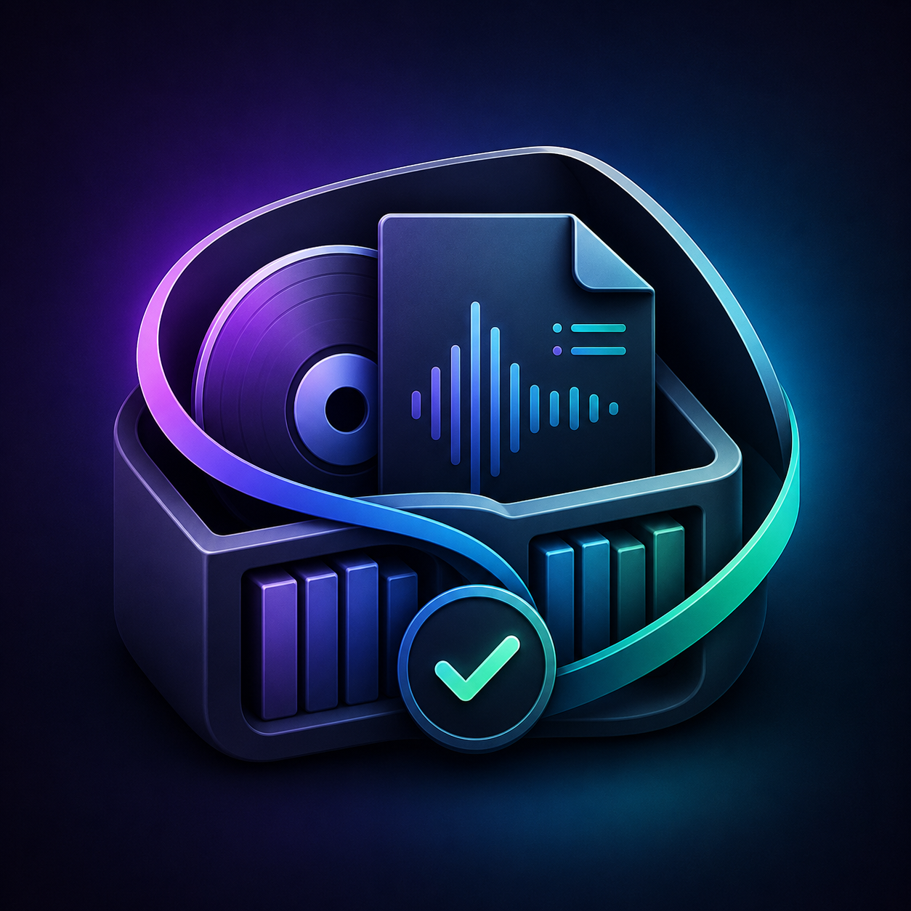
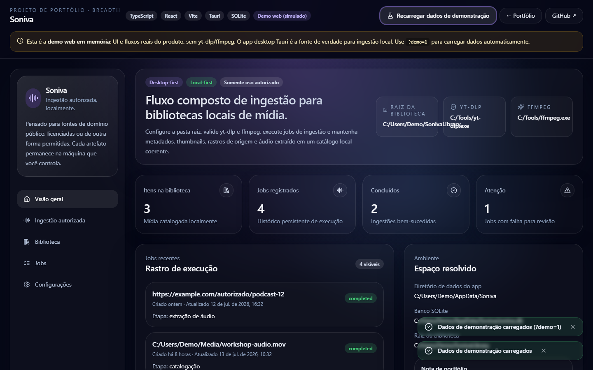
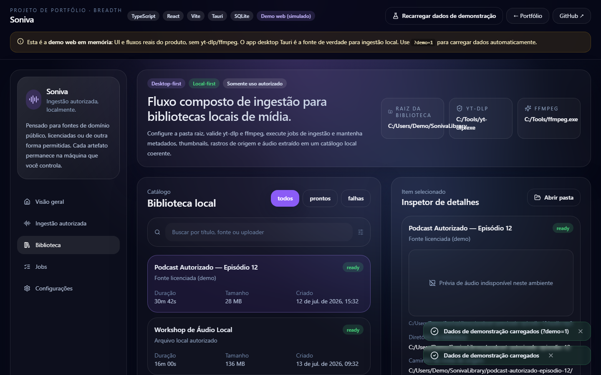
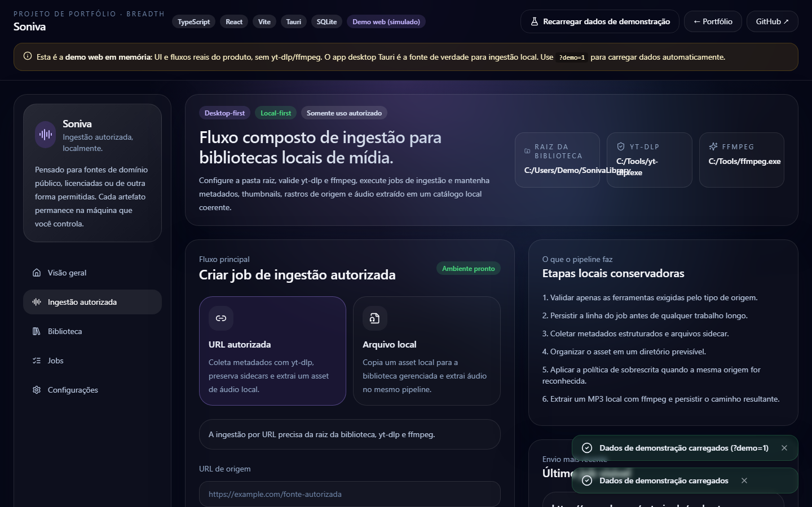
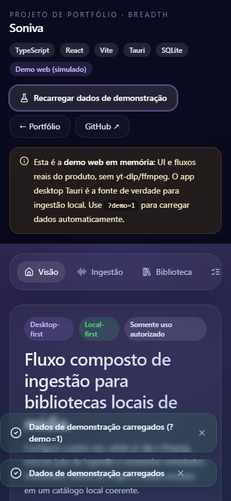

<div align="center">
  

  <h1>Soniva</h1>
  <p><strong>Ingestão autorizada de mídia, local-first — metadados, jobs auditáveis e biblioteca pesquisável.</strong></p>
  <p><em>Desktop-first Tauri app + demo web honesta em memória para walkthrough de portfólio.</em></p>

  <p>
    
    
    
    
    
  </p>
</div>

---

## Screenshots

| Overview | Library |
|---|---|
|  |  |

| Ingest | Mobile |
|---|---|
|  |  |

Mais capturas e como regenerar: [`docs/SCREENSHOTS.md`](docs/SCREENSHOTS.md).

---

## Problema e público

**Problema:** quem organiza mídia própria/licenciada precisa importar, extrair áudio, preservar metadados e achar tudo depois — sem nuvem obrigatória e sem misturar o fluxo com downloaders abusivos. CLIs (`yt-dlp`, `ffmpeg`) resolvem processamento, mas não oferecem biblioteca, jobs e UX com framing ético.

**Público:** criadores, arquivistas pessoais e profissionais que trabalham com fontes autorizadas. No portfólio, também serve como evidência de engenharia full-stack desktop + demo web.

## Solução e fluxo

1. Configurar library root + binários (desktop).
2. Confirmar uso autorizado.
3. Ingerir por URL ou arquivo local.
4. Persistir job → processar → catalogar item + sidecars.
5. Buscar/filtrar na biblioteca; inspecionar metadados e outputs.

Na **demo web**, os mesmos passos rodam sobre um `webStore` em memória (sem subprocessos).

## O que este projeto demonstra

- Produto **local-first** com framing de autorização explícito.
- Full-stack desktop: React + Rust/Tauri + SQLite + subprocessos.
- Separação honesta desktop vs demo web (`tauri.ts` façade).
- DX de portfólio: CI, testes, screenshots, roteiro de entrevista.
- Breadth engineering (UI + persistência + ops locais) — **não** é a peça central de analytics do autor.

## Arquitetura

```text
React UI → tauri.ts
            ├─ Tauri invoke → Rust (SQLite, ffmpeg, yt-dlp, FS)
            └─ Browser → webStore + demoData (memória)
```

Detalhes: [`docs/ARCHITECTURE.md`](docs/ARCHITECTURE.md) · decisões: [`docs/TECHNICAL_DECISIONS.md`](docs/TECHNICAL_DECISIONS.md).

## Stack

React 18 · TypeScript · Vite 6 · Tailwind · Tauri 2 · Rust · SQLite (rusqlite + Drizzle reads) · Vitest · GitHub Actions · Vercel (static demo).

## Estado real, demo e limitações

| Camada | Estado |
|---|---|
| Código nesta branch | `chore/portfolio-quality-pass` — quality pass + evidências |
| Demo web local | ✅ `npm run dev` / `?demo=1` |
| Screenshots | ✅ `docs/screenshots/` |
| CI local | ✅ typecheck + 7 testes + build |
| Deploy produção `soniva-seven.vercel.app` | ⚠️ **pode estar desatualizado** (último promote falhou aqui; preview do commit atual existe com Deployment Protection) |
| App Tauri neste ambiente | ❌ Rust/ffmpeg/yt-dlp não instalados — validação desktop pendente no host do autor |

**Claims permitidos:** local-first; uso autorizado; dual runtime; demo web simulada; MVP desktop.

**Claims proibidos:** “produção enterprise”; “IA”; “a demo web baixa mídia de verdade”; “pipeline Tauri validado nesta máquina”.

## Quick start

```bash
git clone https://github.com/BarujaFe1/Soniva.git
cd Soniva
git checkout chore/portfolio-quality-pass   # até merge em main
npm install
npm run dev
# abra http://localhost:1420/?demo=1
```

Desktop (quando tiver Rust + ffmpeg + yt-dlp):

```bash
npm run tauri:dev
```

## Testes e gates

```bash
npm run ci            # typecheck + test + build
npm run screenshots   # regenera docs/screenshots (após build)
```

Roteiro de entrevista (3–5 min): [`docs/DEMO_SCRIPT.md`](docs/DEMO_SCRIPT.md).

## Decisões e trade-offs

- **Tauri** em vez de Electron: footprint e Rust para pipeline.
- **Demo web separada**: recrutador não precisa instalar toolchain.
- **MP3-only no V1**: menos superfície.
- **Papel no portfólio: selecionado (breadth)** — complementar a peças de dados/analytics.

## Roadmap curto

- [ ] Promover deploy de produção para o commit atual (destravar Vercel CLI/token).
- [ ] Validar `tauri:dev` + preview de mídia no Windows do autor.
- [ ] Merge PR → `main`.
- [ ] Contagens SQL agregadas; CSP/asset scopes mais estreitos.

## Papel no portfólio

**Recomendação: selecionado (breadth engineering), não destaque.**

Use para mostrar amplitude (desktop + UI + local data ops). Não compete com cases de analytics engineering / ciência de dados do autor.

## Documentação

| Doc | Uso |
|---|---|
| [`docs/PORTFOLIO_HANDOFF.md`](docs/PORTFOLIO_HANDOFF.md) | Before/after desta pass |
| [`docs/DEMO_SCRIPT.md`](docs/DEMO_SCRIPT.md) | Entrevista 3–5 min |
| [`docs/DEPLOYMENT.md`](docs/DEPLOYMENT.md) | Vercel + Tauri |
| [`docs/HANDOFF.md`](docs/HANDOFF.md) | Handoff técnico anterior |
| [`CHANGELOG.md`](CHANGELOG.md) | Release note da melhoria |

## Autor

**Felipe Alírio Baruja** · estudante de Estatística/Ciência de Dados (USP) · [GitHub](https://github.com/BarujaFe1) · [Portfólio](https://barujafe1.vercel.app)

## Licença

Ver [`LICENSE`](LICENSE).

---

**Uso responsável:** apenas mídia própria, domínio público, licenças permissivas ou outras fontes permitidas. Não use para burlar direitos autorais.
